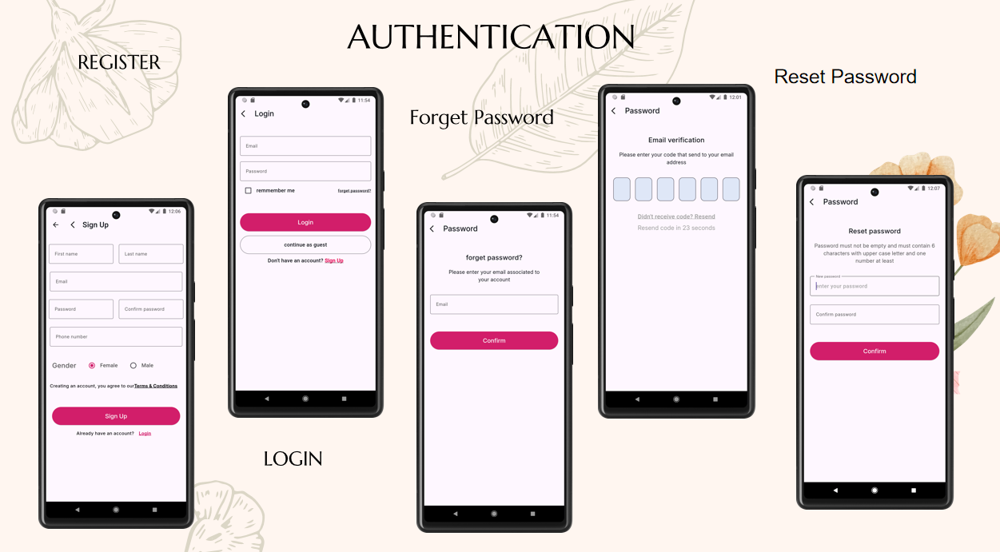
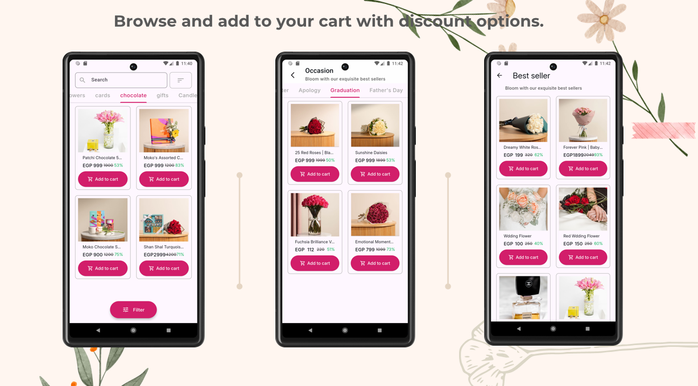
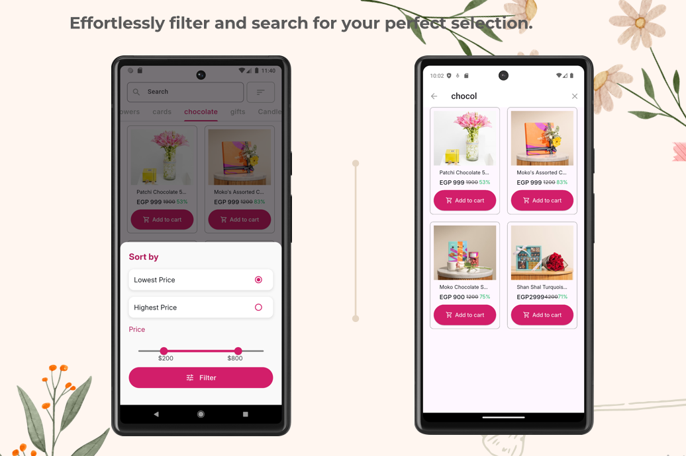
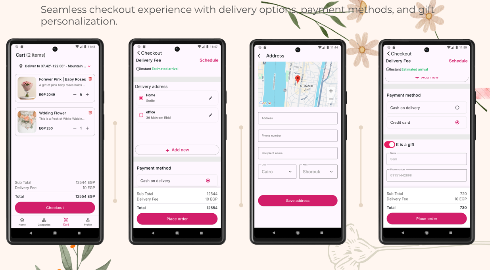
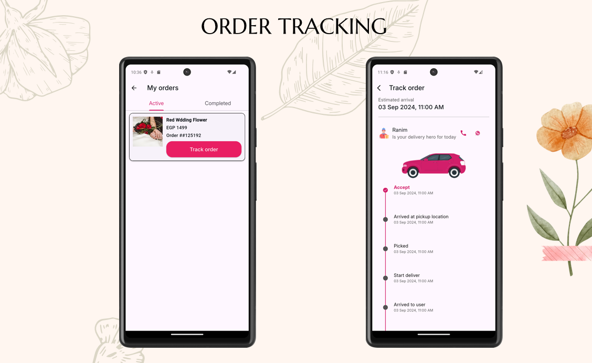

<div align="center">

# 🌸 Flowery


A modern, elegant, and fully functional Flutter e-commerce application designed for ordering flowers online, built with Clean Architecture.

</div>

---

## 🚀 Features

- **Authentication**: Secure user sign-up and login handling via Firebase Auth.
- **Product Browsing**: Explore a rich catalog of flowers and arrangements seamlessly.
- **Shopping Cart**: Add items, modify quantities, and manage your cart efficiently.
- **Order Management**: Track past and current orders effortlessly.
- **Clean Architecture**: Follows industry best practices, ensuring a highly scalable and testable codebase.

---

## 📸 Application Preview

As a senior developer, I've focused on creating a seamless user journey from discovery to delivery. Below is a breakdown of the core modules and the architectural decisions behind them.

---

### 🌊 1. Onboarding & Authentication
The entry point of the app is designed to be inviting yet secure. We use a robust authentication flow powered by **Firebase Auth**, supporting registration, secure login, and a complete password recovery lifecycle (Forget/Reset Password) with OTP verification.

<div align="center">
  
  
</div>

**Key Technical Highlights:**
- **State Management**: Using Bloc to handle sensitive auth states and transitions.
- **Form Validation**: Real-time validation for a better CX (Customer Experience).
- **Security**: Secure storage for session management.

---

### 🏠 2. Home Dashboard & Discovery
The dashboard is the heart of the shopping experience. It features a modular layout with categorized collections (Flowers, Cards, Chocolate, etc.) and specialized sections like "Best Sellers" and "Occasions" to drive user engagement.

<div align="center">
  
</div>

**Key Technical Highlights:**
- **Dynamic Content**: Real-time data fetching from Firestore with optimistic UI updates.
- **Performance**: Optimized list rendering and image caching for smooth scrolling.

---

### 🛍️ 3. Advanced Product Browsing
We've implemented a sophisticated product discovery engine. Users can browse filtered lists, view discounts, and identify best-selling items at a glance.

<div align="center">
  
</div>

**Key Technical Highlights:**
- **Flexible UI**: Reusable grid components that adapt to different product types.
- **Conversion Optimization**: Prominent "Add to Cart" CTAs and clear discount badges.

---

### 🔍 4. Filter & Search Selection
To reduce friction, the app includes a powerful search and filtering system. Users can narrow down their choices by price range, popularity, or specific categories.

<div align="center">
  
</div>

**Key Technical Highlights:**
- **Debounced Search**: Optimized API calls to prevent unnecessary server load.
- **Persistent Filters**: State-preserved filtering logic across different screens.

---

### 🛒 5. Checkout & Personalized Experience
The checkout flow is streamlined for maximum conversion. It supports multiple delivery addresses (with Google Maps integration for accuracy), various payment methods (Cash on Delivery/Credit Card), and a unique "Gift Personalization" feature.

<div align="center">
  
</div>

**Key Technical Highlights:**
- **Complex Forms**: Handling nested data for multiple delivery options and gift details.
- **Transaction Safety**: Atomic operations to ensure order consistency.

---

### 📦 6. Real-time Order Tracking
Post-purchase, the app provides full transparency with an order tracking system. Users can monitor their order's progress from "Accepted" to "Arrived to user" via a clean timeline interface.

<div align="center">
  
</div>

**Key Technical Highlights:**
- **Real-time Updates**: Real-time listeners to Firestore for instant status changes.
- **Visual Feedback**: A clear, intuitive timeline UI for peace of mind.


---

## 🛠️ Tech Stack

- **Framework**: Flutter
- **Language**: Dart
- **Design Pattern**: Clean Architecture
- **Backend / Services**: Firebase (Authentication, Cloud Firestore, Storage)

---

## 🏁 Getting Started

Follow these steps to set up the project locally.

### Prerequisites

- [Flutter SDK](https://flutter.dev/docs/get-started/install) (3.0.0 or higher recommended)
- [Dart SDK](https://dart.dev/get-dart)
- A Firebase project set up for iOS and Android

### Installation

1.  **Clone the repository**

    ```bash
    git clone https://github.com/Omar-Salah17/Flowery.git
    cd flowery
    ```

2.  **Install dependencies**

    ```bash
    flutter pub get
    ```

3.  **Setup Firebase Files**
    - Add your `google-services.json` file inside `android/app/`.
    - Add your `GoogleService-Info.plist` file inside `ios/Runner/`.

### Running the App

Run the application on your connected device or emulator:

```bash
flutter run
```

---

## 🏛️ Clean Architecture Deep-Dive

This project rigorously separates concerns into independent layers:

1. **Presentation Layer**: Contains the UI elements (Widgets, Screens) and State Management to handle user interactions.
2. **Domain Layer**: The core of the application holding business logic, containing Entities, Use Cases, and Repository Interfaces. This layer is entirely independent of other layers.
3. **Data Layer**: Responsible for data retrieval and submission. It includes API integrations, Firebase data sources, Data Transfer Objects (DTOs), and Repository implementations. 

---

## 📂 Project Structure

```text
lib/
├── core/           # Core utilities, theme, routing, and constants
├── data/           # Data sources (Firebase), DTOs, and repository implementations
├── domain/         # Entities, use cases, and repository interfaces
├── presentation/   # UI screens, custom widgets, and state management
└── main.dart       # Application entry point
```

---

## 📄 License

This project is licensed under the MIT License - see the [LICENSE](LICENSE) file for details.
